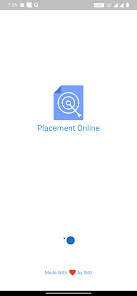
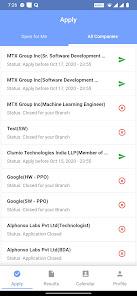
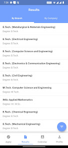
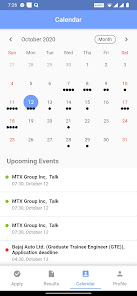
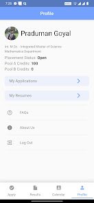
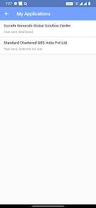

    
    <h1>Placement Mobile app</h1>

     &emsp;
     &emsp;
     &emsp;
     &emsp;
     &emsp;
     &emsp;

 

## Download the app!
Click the below links to download.
- Android: https://play.google.com/store/apps/details?id=com.channeli.img.placementonline
- iOS: https://apps.apple.com/in/app/channel-i-placement-online/id1667945708

## About the app
The Official Placement mobile Application for Indian Institute of Technology Roorkee. You must have a Channel i account to use the app.

## Features
- Sign in with your Channel i account.
- Apply to companies straight from your phone, without opening Channel i.
- Track upcoming application deadlines in a dedicated tab.
- Browse placement results branch-wise or company-wise.
- Search and filter to narrow results down to what you need.

## Terms of Service
Terms to Service: https://docs.google.com/document/d/1vsbooZi9PIiVIMaLts2wv0tODEJafCaRT41zsENYN3I/edit

## Contributing
- Fork the repository to your account.
- Branch out to `a_meaningful_branch_name`.
- Commit your changes.
- File a `Pull request`.
- Get your pull request merged.

It's that simple!

## Credits

